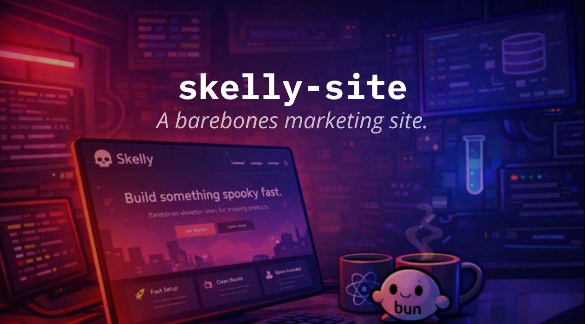

# skelly-backend

> A tiny, opinionated backend skeleton for product-first builders.

Skelly Backend exists to answer one question quickly:

**“Can I start building the product *now* without arguing with my backend?”**

If yes - good. That’s the point.

---

## What This Is

Skelly Backend is a **local-first Bun + SQLite backend skeleton** designed for:

* Prototyping real products
* Moving fast without framework gravity
* Thinking about data *before* APIs
* Staying close to the metal

It is intentionally:

* Small
* Explicit
* Slightly unforgiving

It will not hold your hand.
It will not migrate your database.
It will not scale to millions of users by accident.

That’s a feature.

---

## What This Is (and Can Become)

Skelly Backend is **not trying to be clever**.
It *is* trying to be useful.

Right now (v0), it is:

* A Bun + SQLite backend
* A schema-first workflow
* A minimal tRPC server

That does **not** mean it must stay that way.

This repo is meant to be:

* Forked
* Hacked
* Modified
* Replaced piece by piece

If you want to:

* Swap SQLite for Postgres
* Add migrations
* Introduce Supabase
* Split environments
* Harden auth

Do it.

Skelly is a starting point, not a doctrine.

---

## Tech Stack (Minimal on Purpose)

* **Runtime:** Bun
* **Database:** SQLite (local file)
* **API Layer:** tRPC
* **Validation:** Zod (when you need it)

No Express. No Prisma. No magic.

---

## Project Structure

```
skelly-backend/
├─ src/
│  ├─ db/
│  │  ├─ client.ts      # SQLite bootstrap + schema loader
│  │  └─ schema.sql     # REQUIRED: database skeleton
│  ├─ routes/
│  │  └─ healthCheck.ts # sanity check endpoint
│  ├─ appRouter.ts      # root tRPC router
│  ├─ trpc.ts           # tRPC setup + context
│  └─ server.ts         # Bun server entrypoint
├─ skelly.db            # local SQLite database (generated)
├─ package.json
└─ README.md
```

---

## How It Boots (Important)

On server start:

1. `src/db/client.ts` runs
2. SQLite database file is created (if missing)
3. `schema.sql` is executed **in full**
4. Server starts only if schema succeeds

If `schema.sql` is wrong, empty, or broken - **the backend fails**.

This is intentional.

---

## The Schema Contract

`schema.sql` is not optional.

You **must** define your tables *before* running the backend.

Rules:

* No migrations
* No rollbacks
* Change schema → delete `skelly.db`
* Restart server

This friction forces you to:

* Think about data shape early
* Avoid half-baked models
* Treat your database like a product surface

When the model stabilizes, port it elsewhere.

---

## Running the Backend

```bash
bun install
bun run dev
```

Server:

```
http://localhost:3001
```

tRPC endpoint:

```
http://localhost:3001/trpc
```

---

## Health Check

A single sanity endpoint exists:

```
health.check
```

If this works, the skeleton is alive.

---

## CORS

CORS is explicitly enabled for:

```
http://localhost:5173
```

This is assumed to be your admin frontend during development.

Change it when you care.

---

## Philosophy (Short Version)

* Start boring
* Stay explicit
* Delete freely
* Earn complexity

Skelly is a skeleton.
Add muscle only when the product demands it.

---

## When to Outgrow This

You should replace or extend Skelly Backend when:

* You need migrations
* You need multiple environments
* You need hosted databases
* You stop deleting tables casually

Until then - this is enough.

---

## Final Note ☠️

If this backend feels almost *too* small,
that’s the correct feeling.

Happy building.
